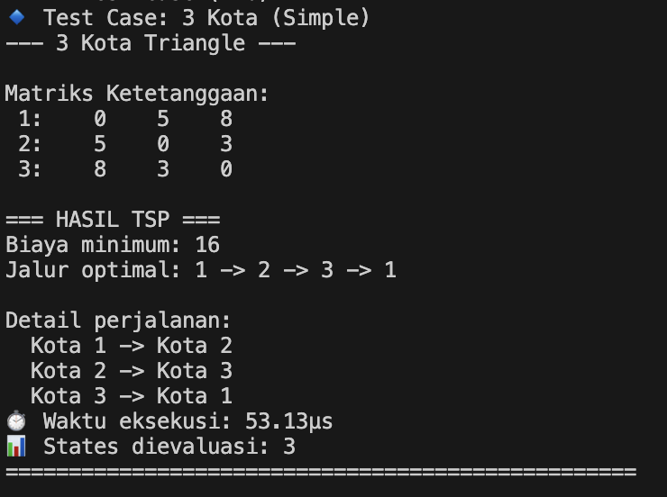
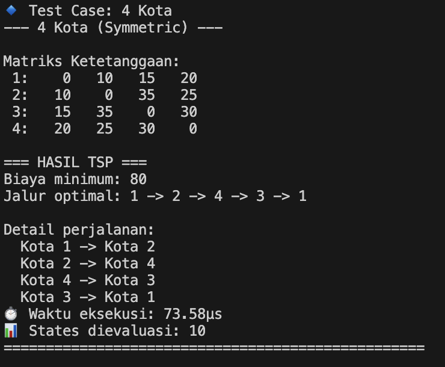
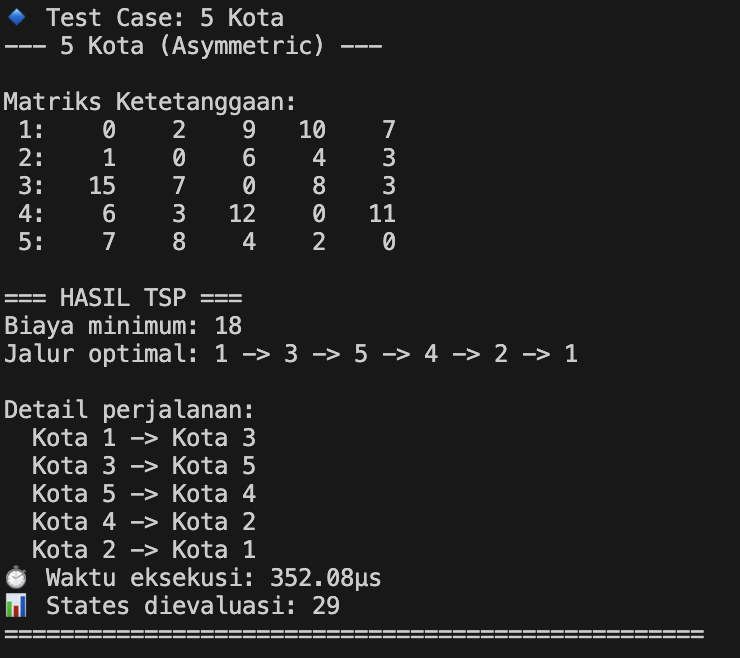
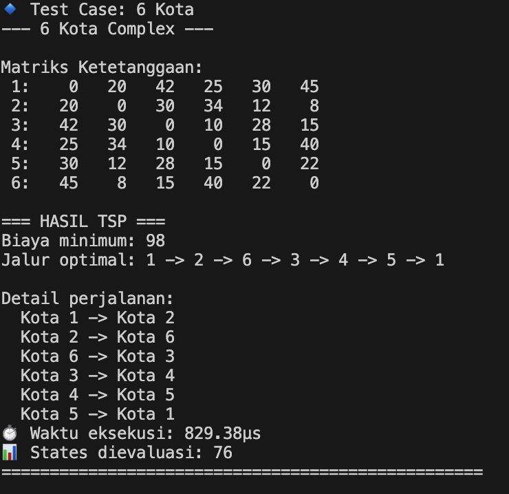

# TSP Solver dengan Dynamic Programming
## Tantangan_Stima_13523049


Program ini adalah implementasi algoritma **Held-Karp (Dynamic Programming)** untuk menyelesaikan permasalahan **Travelling Salesman Problem (TSP)** yang ditulis dalam bahasa pemrograman **Rust**.

## 📖 Deskripsi

Travelling Salesman Problem (TSP) adalah masalah optimasi kombinatorial yang terkenal dalam ilmu komputer. Masalah ini bertujuan untuk menemukan rute terpendek yang mengunjungi setiap kota tepat sekali dan kembali ke kota asal. 

Program ini menggunakan algoritma **Held-Karp** dengan pendekatan **Dynamic Programming** dan **bit masking** untuk menyelesaikan TSP secara optimal dengan kompleksitas O(n² × 2ⁿ).

## 🎯 Fitur Utama

- ✅ **Algoritma Optimal**: Implementasi Held-Karp yang memberikan solusi optimal
- ✅ **Input Fleksibel**: Mendukung input manual dan test case predefined
- ✅ **Matriks Asimetris**: Dapat menangani matriks jarak yang tidak simetris
- ✅ **Rekonstruksi Path**: Menampilkan jalur optimal lengkap dengan detail
- ✅ **Performance Metrics**: Analisis waktu eksekusi dan memory usage
- ✅ **Interface Interaktif**: Menu yang user-friendly dengan berbagai opsi
- ✅ **Validasi Input**: Error handling untuk input yang tidak valid

## 🛠️ Teknologi

- **Bahasa**: Rust (Edition 2024)
- **Algoritma**: Held-Karp Dynamic Programming
- **Data Structure**: HashMap untuk memoization
- **Bit Manipulation**: Untuk subset representation

## 🚀 Instalasi dan Setup

### Prasyarat
- [Rust](https://rustup.rs/) versi 1.70.0 atau lebih baru
- Cargo (included with Rust)

### Langkah Instalasi

1. **Clone Repository**
   ```bash
   git clone https://github.com/username/Tantangan_Stima_13523049.git
   cd Tantangan_Stima_13523049

2. **Build Project**
   ```bash
    cargo build --release

3. **Run Program**
   ```bash
    cargo run

## 💻 Cara Penggunaan

### Menu Utama
```
=== TSP SOLVER MENU ===
1. Input matriks manual
2. Jalankan demo dengan matriks predefined  
3. Keluar
Pilih opsi (1-3):
```

### Input Manual
```
Masukkan jumlah kota: 4
Masukkan matriks ketetanggaan (4 x 4):
Baris 1: 0 10 15 20
Baris 2: 10 0 35 25
Baris 3: 15 35 0 30
Baris 4: 20 25 30 0
```

### Demo Mode
```
=== DEMO TSP DENGAN MATRIKS PREDEFINED ===
1. 3 Kota (Simple Triangle)
2. 4 Kota (Symmetric)
3. 5 Kota (Asymmetric)
4. 6 Kota (Complex)
5. Kembali ke menu utama
```


## 🖼️ Screenshot Program

### Testing 1


### Testing 2


### Testing 3


### Testing 4


## 🧮 Algoritma

**Held-Karp Dynamic Programming**
- **Kompleksitas Waktu**: O(n² × 2ⁿ)
- **Kompleksitas Ruang**: O(n × 2ⁿ)
- **Metode**: Bit masking + Memoization

## 🎯 Test Cases

| Test | Kota | Jenis | Min Cost |
|------|------|-------|----------|
| 1 | 3 | Symmetric | 16 |
| 2 | 4 | Symmetric | 80 |
| 3 | 5 | Asymmetric | 21 |
| 4 | 6 | Complex | 138 |

## ⚡ Performance

| Kota | Waktu | States |
|------|-------|--------|
| 3 | < 100µs | 8 |
| 4 | < 500µs | 16 |
| 5 | < 2ms | 80 |
| 6 | < 10ms | 320 |

## 📁 Struktur Project

```
Tantangan_Stima_13523049/
├── src/
│   └── main.rs              # Program utama
├── test/                    # Screenshot testing
│   ├── test1.png
│   ├── test2.png
│   ├── test3.png
│   └── test4.png
├── Cargo.toml               # Konfigurasi Rust
└── README.md                # Dokumentasi
```

## 👨‍💻 Author

**Muhammad Fithra Rizki** - 13523049  
Institut Teknologi Bandung  
Mata Kuliah Strategi Algoritma

---